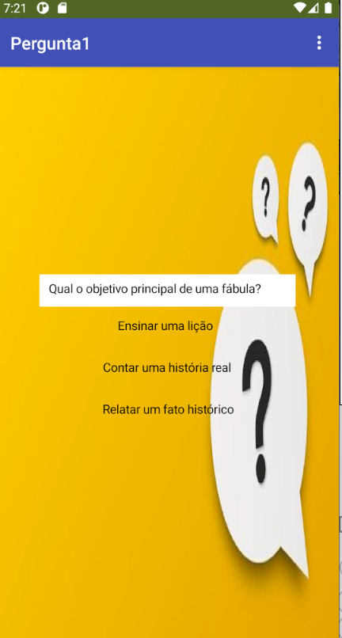
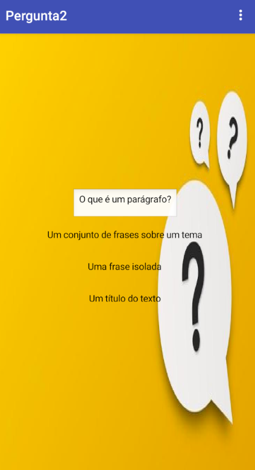
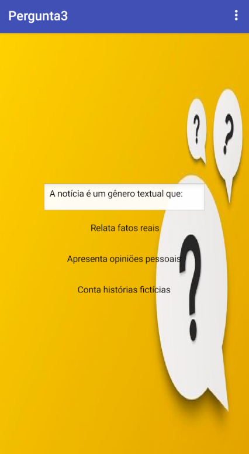
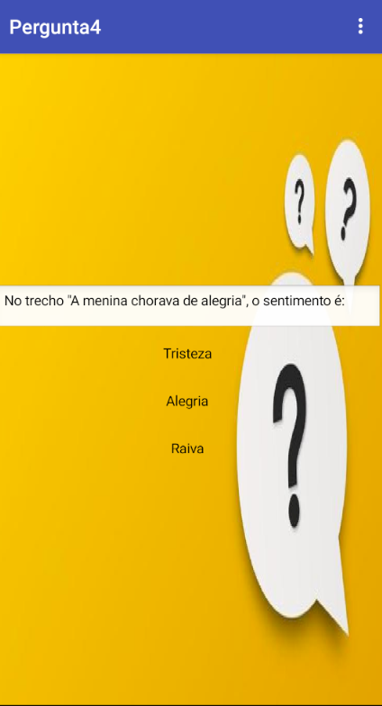
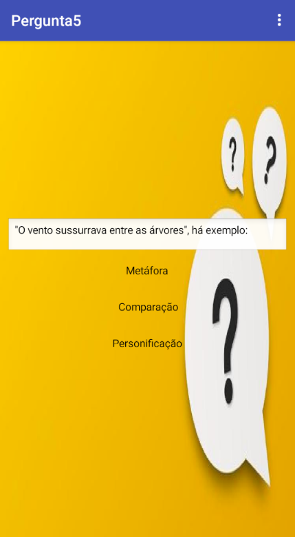
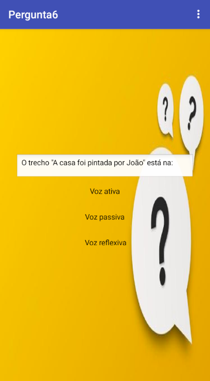
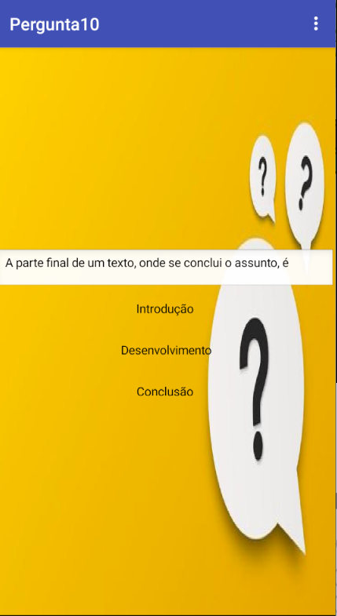

# App.inventor

## Quiz de Português 

## Tecnologias utilizadas
  - Mit App Inventor
  - .apk
  - .aia

# imagens das telas
 
 .
 .
 .
 .
 .
 .
 .
 .
 .
 .
 .

## Feedback do professor de Português 

- Bom, tem pegadinhas e esta bem desenvolvido 
